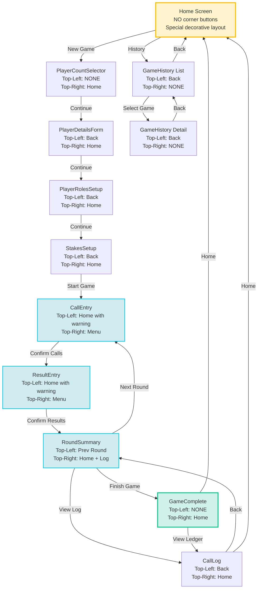
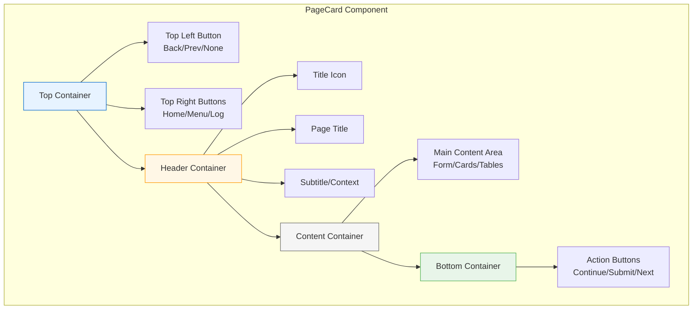
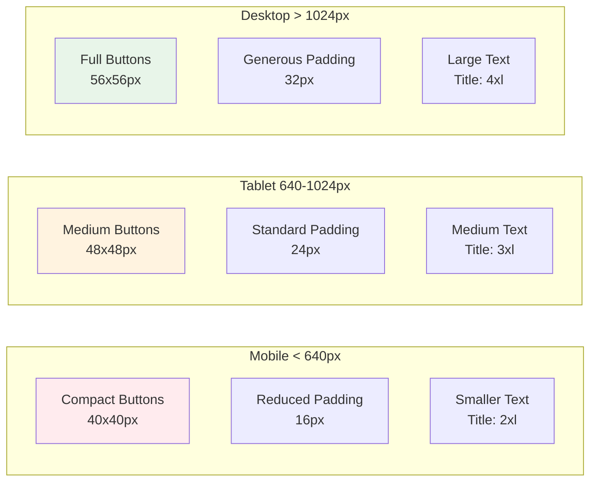
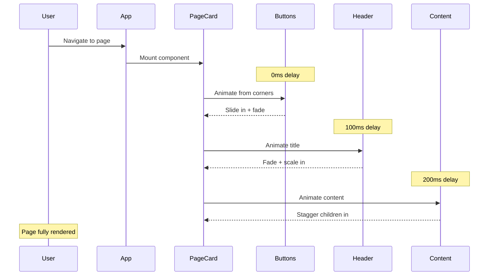

# Card Layout Visual Architecture

## Page Flow with Card Layout Pattern



## Card Component Structure



## Button Configuration Matrix

| Page | Top-Left | Top-Right | Bottom Primary | Notes |
|------|----------|-----------|----------------|-------|
| **Home** | — | — | New Game, History | Special: No corner buttons |
| **PlayerCount** | — | Home | Continue | First setup page |
| **PlayerDetails** | Back | Home | Continue | Can go back to count |
| **PlayerRoles** | Back | Home | Continue | Seating arrangement |
| **Stakes** | Back | Home | Start Game | Last setup |
| **CallEntry** | Home⚠️ | Menu | Confirm Calls | Unsaved warning |
| **ResultEntry** | Home⚠️ | Menu | Confirm Results | Unsaved warning |
| **RoundSummary** | Prev/— | Home, Log | Next Round | Prev only if R>1 |
| **CallLog** | Back | Home | Back (optional) | Scrollable table |
| **GameComplete** | — | Home | Play Again, View Log, Home | Victory screen |
| **History List** | Back | — | — | Scroll list |
| **History Detail** | Back | — | — | Game details |

⚠️ = Shows warning if unsaved changes exist

## Responsive Behavior



## Animation Sequence



## Layout Measurements

### Card Padding Structure
```
┌─────────────────────────────────────────┐
│ 24px (p-6)                              │
│  ┌──────────────────────────────────┐   │
│  │ [Btn]                      [Btn] │   │ ← Buttons in padding
│  │                                  │   │
│  │ 24px gap-6                       │   │
│  │                                  │   │
│  │          Page Title              │   │ ← Header section
│  │          Subtitle                │   │
│  │                                  │   │
│  │ ────────────────────────────     │   │ ← Optional divider
│  │                                  │   │
│  │                                  │   │
│  │       Content Area               │   │ ← Main content
│  │                                  │   │
│  │                                  │   │
│  │                                  │   │
│  │ ────────────────────────────     │   │
│  │                                  │   │
│  │    [Action Buttons]              │   │ ← Bottom actions
│  └──────────────────────────────────┘   │
│ 24px (p-6)                              │
└─────────────────────────────────────────┘
```

### Button Sizes (Responsive)
- **Mobile:** 40x40px (w-10 h-10), text-base, icon h-5 w-5
- **Tablet:** 48x48px (w-12 h-12), text-lg, icon h-6 w-6  
- **Desktop:** 56x56px (w-14 h-14), text-xl, icon h-7 w-7

### Typography Scale
- **Title:** text-2xl sm:text-3xl lg:text-4xl
- **Subtitle:** text-sm sm:text-base lg:text-lg
- **Content:** text-base sm:text-lg
- **Buttons:** text-base sm:text-lg lg:text-xl

## Special Cases

### HomeScreen (Unique Layout)
- No PageCard wrapper (keep existing fancy design)
- Maintains decorative floating cards
- Card spread header animation
- Gradient title
- Direct action buttons in separate cards

### CallLog (Table with Scroll)
```
┌─────────────────────────────────────────┐
│ [Back]                          [Home]  │
│                                         │
│            Game Ledger                  │
│         Complete match history          │
│ ─────────────────────────────────────── │
│ ┌─────────────────────────────────────┐ │
│ │ Table with horizontal scroll        │ │
│ │ (if needed on mobile)               │ │
│ │                                     │ │
│ └─────────────────────────────────────┘ │
│                                         │
│          [Back Button]                  │
└─────────────────────────────────────────┘
```

### GameHistory (Two Views)
**List View:**
- Scrollable list of game cards
- Each game card is clickable
- No bottom buttons (scroll to see more)

**Detail View:**
- Scrollable content (winner, standings, rounds)
- Back button returns to list
- No bottom action needed

## Implementation Notes

### Z-Index Management
- Card container: z-0 (base)
- Corner buttons: z-10 (above content)
- Modals/Menus: z-20 (above buttons)
- Loading overlays: z-30 (top layer)

### Touch Target Guidelines
- Minimum 44x44px for all interactive elements
- 8px spacing between touch targets
- Increase button size on mobile if needed
- Consider thumb zones on phone screens

### Accessibility Checklist
- [ ] All icon buttons have aria-label
- [ ] Page title announced on navigation
- [ ] Focus management on page changes
- [ ] Keyboard shortcuts (Esc to go back, etc.)
- [ ] Screen reader announcements for state changes
- [ ] Color contrast meets WCAG AA standards
- [ ] Touch targets meet minimum size requirements